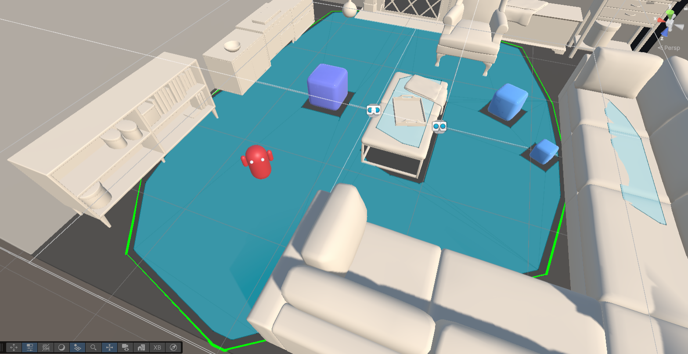
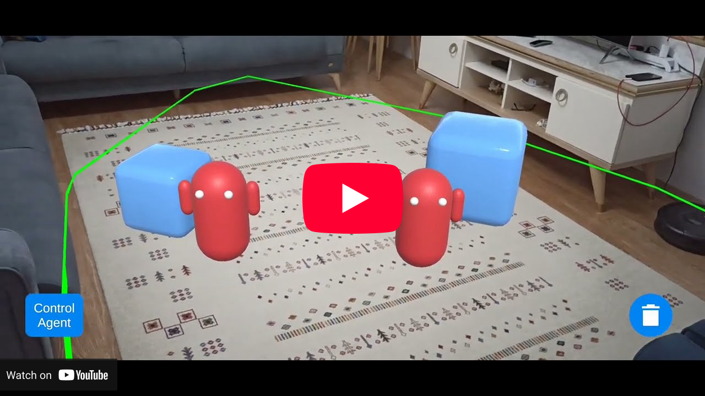

# Unity Augmented Reality Examples

This repository provides an example for the integration of [AR Foundation](https://docs.unity3d.com/Packages/com.unity.xr.arfoundation@6.1/manual/index.html) (Augmented Reality) and [AI Pathfinding](https://docs.unity3d.com/Packages/com.unity.ai.navigation@2.0/manual/index.html) (NavMesh). It aims to be able to use pathfinding in real environments and is based on official Unity examples for the plane (surface) detection.

The screenshot below shows NavMesh surface created in a simulated augmented reality environment.

  

## Android Application

This repository is ready to be built for Android and tested in real life via the application. Obstacles and agents can be placed and controlled in the real environments within the application. The YouTube video below is taken from the Android app and shows how the pathfinding system works in a real environment.

